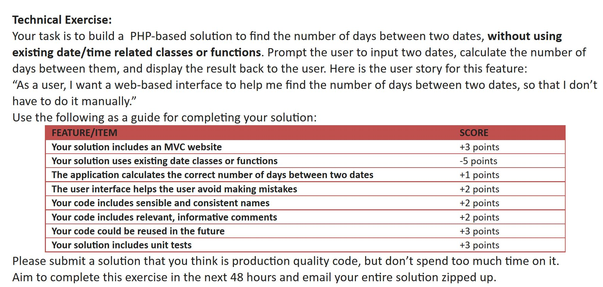

Date-Differ
===========

Finding a way to calculate dates without using existing date/time functions.

Same workaround as everything: scrape it!

Wolfram Alpha has a good scrapable API that can be used for this type of thing.

# Build
	git clone `https://github.com/ptraverse/php-blsht.git` && cd php-blsht
	php composer.phar install
	php composer.phar run-script start

# Test 
	php composer.phar run-script test

